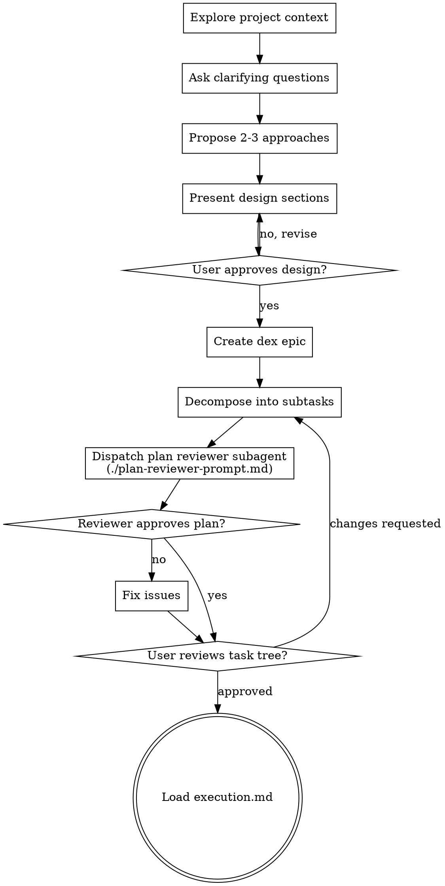

# Brainstorming Ideas Into Designs

Help turn ideas into fully formed designs and specs through natural collaborative dialogue.

Start by understanding the current project context, then ask questions one at a time to refine the idea. Once you understand what you're building, present the design and get user approval. Then decompose the design into a dex task tree.

<HARD-GATE>
Do NOT invoke any implementation skill, write any code, scaffold any project, or take any implementation action until you have presented a design and the user has approved it. This applies to EVERY project regardless of perceived simplicity.
</HARD-GATE>

## Anti-Pattern: "This Is Too Simple To Need A Design"

Every project goes through this process. A todo list, a single-function utility, a config change — all of them. "Simple" projects are where unexamined assumptions cause the most wasted work. The design can be short (a few sentences for truly simple projects), but you MUST present it and get approval.

## Checklist

Complete these steps in order:

1. **Explore project context** — check files, docs, recent commits
2. **Ask clarifying questions** — one at a time, understand purpose/constraints/success criteria
3. **Propose 2-3 approaches** — with trade-offs and your recommendation
4. **Present design** — in sections scaled to their complexity, get user approval after each section
5. **Create dex epic** — save the validated design as a dex epic description (see below)
6. **Decompose into dex subtasks** — break the design into implementation tasks with blocking dependencies (see below)
7. **Plan review (subagent)** — dispatch a reviewer subagent to check the task tree for dependency accuracy, research gaps, granularity, and completeness (see below)
8. **User reviews task tree** — ask user to review the dex tasks before proceeding
9. **Transition to execution** — load `execution.md` to begin implementation

## Process Flow



**The terminal state is loading `execution.md`.** Do NOT load any other phase document. The ONLY next step after brainstorming is execution.

## The Process

**Understanding the idea:**

- Check out the current project state first (files, docs, recent commits)
- Before asking detailed questions, assess scope: if the request describes multiple independent subsystems (e.g., "build a platform with chat, file storage, billing, and analytics"), flag this immediately. Don't spend questions refining details of a project that needs to be decomposed first.
- If the project is too large for a single design, help the user decompose into sub-projects: what are the independent pieces, how do they relate, what order should they be built? Then brainstorm the first sub-project through the normal design flow. Each sub-project gets its own dex epic → subtasks → implementation cycle.
- For appropriately-scoped projects, ask questions one at a time to refine the idea
- Prefer multiple choice questions when possible, but open-ended is fine too
- Only one question per message - if a topic needs more exploration, break it into multiple questions
- Focus on understanding: purpose, constraints, success criteria

**Exploring approaches:**

- Propose 2-3 different approaches with trade-offs
- Present options conversationally with your recommendation and reasoning
- Lead with your recommended option and explain why

**Presenting the design:**

- Once you believe you understand what you're building, present the design
- Scale each section to its complexity: a few sentences if straightforward, up to 200-300 words if nuanced
- Ask after each section whether it looks right so far
- Cover: architecture, components, data flow, error handling, testing
- Be ready to go back and clarify if something doesn't make sense

**Design for isolation and clarity:**

- Break the system into smaller units that each have one clear purpose, communicate through well-defined interfaces, and can be understood and tested independently
- For each unit, you should be able to answer: what does it do, how do you use it, and what does it depend on?
- Can someone understand what a unit does without reading its internals? Can you change the internals without breaking consumers? If not, the boundaries need work.
- Smaller, well-bounded units are also easier for you to work with - you reason better about code you can hold in context at once, and your edits are more reliable when files are focused. When a file grows large, that's often a signal that it's doing too much.

**Working in existing codebases:**

- Explore the current structure before proposing changes. Follow existing patterns.
- Where existing code has problems that affect the work (e.g., a file that's grown too large, unclear boundaries, tangled responsibilities), include targeted improvements as part of the design - the way a good developer improves code they're working in.
- Don't propose unrelated refactoring. Stay focused on what serves the current goal.

## After the Design: Creating the Dex Task Tree

### Step 6: Create Dex Epic

Save the validated design as a dex epic:

```bash
dex create "Feature name" --description "Full design text..."
```

The epic description should contain the complete design — architecture, components, data flow, error handling approach, and testing strategy. This is the authoritative reference for the implementation.

### Step 7: Decompose Into Subtasks

Break the design into implementation tasks under the epic:

```bash
dex create --parent <epic-id> "Task name" --description "..."
dex edit <task-id> --add-blocker <dependency-id>  # for sequential dependencies
```

**Each subtask description must include:**
- **Scope:** What this task does and doesn't cover
- **Approach:** How to implement it (files to create/modify, key decisions)
- **Files:** Exact paths to create, modify, and test
- **Done criteria:** What "complete" looks like for this task

**Subtask description quality requirements:**
- No placeholders: no "TBD", "TODO", "implement later", "fill in details"
- No vague instructions: no "add appropriate error handling", "write tests for the above"
- No cross-references without content: no "similar to Task N" — repeat what's needed
- Complete code context: if a step changes code, describe what changes
- Exact file paths always

**Decomposition guidelines:**
- Small feature (1-2 files) → Single task, no subtasks needed
- Medium feature (3-5 files) → 3-7 subtasks
- Large initiative (5+ independent tasks) → Epic with tasks
- 3-7 children per parent is optimal. Don't over-decompose.

### Step 8: Plan Review (Subagent)

**Do NOT self-check the plan.** The agent who built the plan sees what it intended, not what it wrote. Dispatch a reviewer subagent using `plan-reviewer-prompt.md` with the epic ID. The reviewer reads the tasks from dex directly.

If the reviewer finds issues, fix them. No need to re-review after fixing — the user review gate (Step 9) follows immediately.

### Step 9: User Review Gate

After the self-check passes, ask the user to review the task tree:

> "Task tree created under dex epic `<id>`. Run `dex show <epic-id> --expand` to review. Let me know if you want to make any changes before we start implementation."

Wait for the user's response. If they request changes, make them and re-run the self-check. Only proceed once the user approves.

## Key Principles

- **One question at a time** - Don't overwhelm with multiple questions
- **Multiple choice preferred** - Easier to answer than open-ended when possible
- **Consider YAGNI** - Don't add speculative features nobody asked for
- **Correctness is non-negotiable** - Code is cheap. If something is critical to the system working correctly, it stays in the design. Never cut correctness requirements to reduce effort.
- **Escalate scope reductions, don't decide them** - You can recommend cutting something, but the user decides. Never present a reduced scope as a fait accompli.
- **Explore alternatives** - Always propose 2-3 approaches before settling
- **Incremental validation** - Present design, get approval before moving on
- **Be flexible** - Go back and clarify when something doesn't make sense

## Red Flags — Scope Reduction

If you find yourself thinking any of these, stop — you're about to cut something the user may consider critical:

| Thought | Reality |
|---------|---------|
| "This is too much effort for now" | Code is cheap. Present the full-effort option and let the user decide. |
| "We can add this later" | Later means never, and the user didn't ask for a phased approach. Ask first. |
| "This is out of scope" | You're defining scope right now. If it's relevant to correctness, it's in scope until the user says otherwise. |
| "Let's keep it simple for v1" | Simplicity is good. Cutting correctness requirements is not simplicity — it's cutting corners. |
| "This would require changing too much existing code" | That's an effort estimate, not a design argument. Present the change with the effort noted and let the user decide. |
| "YAGNI" | YAGNI applies to speculative features nobody asked for. It does not apply to requirements that ensure the system works correctly. |

**The rule:** You can recommend against including something. You MUST NOT unilaterally remove it from the design. Present the trade-off and let the user choose.

## Explaining With Structure

When presenting designs, problems, or solutions, **show structure visually** using ASCII diagrams in the terminal. A diagram communicates architecture faster than prose and gives the user something concrete to react to.

**Default to visual explanation.** Don't wait to be asked. If what you're describing has components, flow, hierarchy, or spatial relationships, draw it.

**Scope explanations one step wider than the immediate question.** If the user asks about a component, show where it sits in the system. If they ask about a flow, show what triggers it and what it feeds into. The user shouldn't have to ask "what calls this?" or "what happens next?" — that context should already be in the diagram.

**Use the right format for the content:**

```
Call trees — who calls what, and in what order:

  handleRequest()
  ├── validateInput()
  │   ├── checkAuth()
  │   └── parseBody()
  ├── processOrder()
  │   ├── checkInventory()
  │   └── createTransaction()
  └── sendResponse()

Component/data flow — how pieces connect:

  ┌──────────┐     ┌───────────┐     ┌──────────┐
  │  Client  │────▶│  Gateway  │────▶│ Service  │
  └──────────┘     └───────────┘     └──────────┘
                         │
                         ▼
                   ┌───────────┐
                   │   Cache   │
                   └───────────┘

Directory/file structure:

  src/
  ├── hooks/
  │   ├── install.ts      ← new
  │   └── verify.ts       ← new
  ├── config/
  │   └── schema.ts       ← modified
  └── index.ts

State machines / decision flow:

  IDLE ──▶ LOADING ──▶ READY
                │         │
                ▼         ▼
             ERROR    PROCESSING ──▶ DONE
                         │
                         ▼
                       ERROR

UI wireframes (for web/CLI layouts):

  ┌─────────────────────────────────┐
  │  Header          [Save] [Exit] │
  ├──────────┬──────────────────────┤
  │ Sidebar  │  Main content area   │
  │          │                      │
  │ • Item 1 │  ┌────────────────┐  │
  │ • Item 2 │  │   Editor       │  │
  │ • Item 3 │  │                │  │
  │          │  └────────────────┘  │
  └──────────┴──────────────────────┘
```

**When to use which:** Call trees for understanding execution paths. Component diagrams for architecture discussions. File trees for showing what changes where. State machines for lifecycle/workflow questions. Wireframes for UI layout discussions.

These are not decoration — they are the primary medium for communicating structure. Prose accompanies the diagram to explain *why*, the diagram shows *what*.
