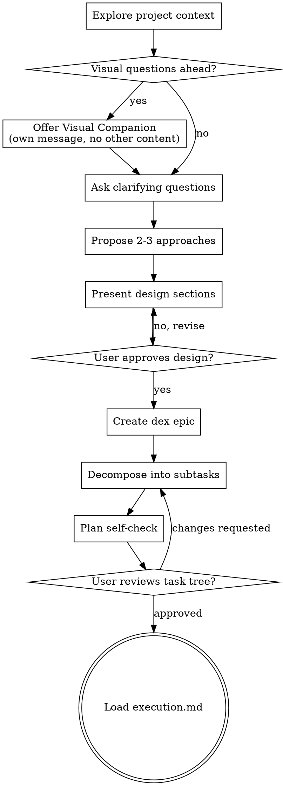

# Brainstorming Ideas Into Designs

Help turn ideas into fully formed designs and specs through natural collaborative dialogue.

Start by understanding the current project context, then ask questions one at a time to refine the idea. Once you understand what you're building, present the design and get user approval. Then decompose the design into a dex task tree.

<HARD-GATE>
Do NOT invoke any implementation skill, write any code, scaffold any project, or take any implementation action until you have presented a design and the user has approved it. This applies to EVERY project regardless of perceived simplicity.
</HARD-GATE>

## Anti-Pattern: "This Is Too Simple To Need A Design"

Every project goes through this process. A todo list, a single-function utility, a config change — all of them. "Simple" projects are where unexamined assumptions cause the most wasted work. The design can be short (a few sentences for truly simple projects), but you MUST present it and get approval.

## Checklist

Complete these steps in order:

1. **Explore project context** — check files, docs, recent commits
2. **Offer visual companion** (if topic will involve visual questions) — this is its own message, not combined with a clarifying question. See the Visual Companion section below.
3. **Ask clarifying questions** — one at a time, understand purpose/constraints/success criteria
4. **Propose 2-3 approaches** — with trade-offs and your recommendation
5. **Present design** — in sections scaled to their complexity, get user approval after each section
6. **Create dex epic** — save the validated design as a dex epic description (see below)
7. **Decompose into dex subtasks** — break the design into implementation tasks with blocking dependencies (see below)
8. **Plan self-check** — review the task tree for dependency accuracy, research gaps, granularity, and completeness (see below)
9. **User reviews task tree** — ask user to review the dex tasks before proceeding
10. **Transition to execution** — load `execution.md` to begin implementation

## Process Flow



**The terminal state is loading `execution.md`.** Do NOT load any other phase document. The ONLY next step after brainstorming is execution.

## The Process

**Understanding the idea:**

- Check out the current project state first (files, docs, recent commits)
- Before asking detailed questions, assess scope: if the request describes multiple independent subsystems (e.g., "build a platform with chat, file storage, billing, and analytics"), flag this immediately. Don't spend questions refining details of a project that needs to be decomposed first.
- If the project is too large for a single design, help the user decompose into sub-projects: what are the independent pieces, how do they relate, what order should they be built? Then brainstorm the first sub-project through the normal design flow. Each sub-project gets its own dex epic → subtasks → implementation cycle.
- For appropriately-scoped projects, ask questions one at a time to refine the idea
- Prefer multiple choice questions when possible, but open-ended is fine too
- Only one question per message - if a topic needs more exploration, break it into multiple questions
- Focus on understanding: purpose, constraints, success criteria

**Exploring approaches:**

- Propose 2-3 different approaches with trade-offs
- Present options conversationally with your recommendation and reasoning
- Lead with your recommended option and explain why

**Presenting the design:**

- Once you believe you understand what you're building, present the design
- Scale each section to its complexity: a few sentences if straightforward, up to 200-300 words if nuanced
- Ask after each section whether it looks right so far
- Cover: architecture, components, data flow, error handling, testing
- Be ready to go back and clarify if something doesn't make sense

**Design for isolation and clarity:**

- Break the system into smaller units that each have one clear purpose, communicate through well-defined interfaces, and can be understood and tested independently
- For each unit, you should be able to answer: what does it do, how do you use it, and what does it depend on?
- Can someone understand what a unit does without reading its internals? Can you change the internals without breaking consumers? If not, the boundaries need work.
- Smaller, well-bounded units are also easier for you to work with - you reason better about code you can hold in context at once, and your edits are more reliable when files are focused. When a file grows large, that's often a signal that it's doing too much.

**Working in existing codebases:**

- Explore the current structure before proposing changes. Follow existing patterns.
- Where existing code has problems that affect the work (e.g., a file that's grown too large, unclear boundaries, tangled responsibilities), include targeted improvements as part of the design - the way a good developer improves code they're working in.
- Don't propose unrelated refactoring. Stay focused on what serves the current goal.

## After the Design: Creating the Dex Task Tree

### Step 6: Create Dex Epic

Save the validated design as a dex epic:

```bash
dex create "Feature name" --description "Full design text..."
```

The epic description should contain the complete design — architecture, components, data flow, error handling approach, and testing strategy. This is the authoritative reference for the implementation.

### Step 7: Decompose Into Subtasks

Break the design into implementation tasks under the epic:

```bash
dex create --parent <epic-id> "Task name" --description "..."
dex edit <task-id> --add-blocker <dependency-id>  # for sequential dependencies
```

**Each subtask description must include:**
- **Scope:** What this task does and doesn't cover
- **Approach:** How to implement it (files to create/modify, key decisions)
- **Files:** Exact paths to create, modify, and test
- **Done criteria:** What "complete" looks like for this task

**Subtask description quality requirements:**
- No placeholders: no "TBD", "TODO", "implement later", "fill in details"
- No vague instructions: no "add appropriate error handling", "write tests for the above"
- No cross-references without content: no "similar to Task N" — repeat what's needed
- Complete code context: if a step changes code, describe what changes
- Exact file paths always

**Decomposition guidelines:**
- Small feature (1-2 files) → Single task, no subtasks needed
- Medium feature (3-5 files) → 3-7 subtasks
- Large initiative (5+ independent tasks) → Epic with tasks
- 3-7 children per parent is optimal. Don't over-decompose.

### Step 8: Plan Self-Check

After creating the task tree, review it before moving on:

1. **Dependency accuracy** — does each `blocked-by` relationship reflect a real build/type/data dependency? Remove false dependencies that would serialize parallelizable work.
2. **Research gaps** — are there open questions (which library, which API, which approach) that could become rabbit holes during implementation? Pin them down in the task description or call them out as risks.
3. **Task granularity** — is each task's value clear? If a task's purpose overlaps heavily with another, fold them together or sharpen the distinction.
4. **Completeness** — do the subtasks cover all done criteria from the epic?

Fix any issues found. No need to re-review — just fix and move on.

### Step 9: User Review Gate

After the self-check passes, ask the user to review the task tree:

> "Task tree created under dex epic `<id>`. Run `dex show <epic-id> --expand` to review. Let me know if you want to make any changes before we start implementation."

Wait for the user's response. If they request changes, make them and re-run the self-check. Only proceed once the user approves.

## Key Principles

- **One question at a time** - Don't overwhelm with multiple questions
- **Multiple choice preferred** - Easier to answer than open-ended when possible
- **YAGNI ruthlessly** - Remove unnecessary features from all designs
- **Explore alternatives** - Always propose 2-3 approaches before settling
- **Incremental validation** - Present design, get approval before moving on
- **Be flexible** - Go back and clarify when something doesn't make sense

## Visual Companion

A browser-based companion for showing mockups, diagrams, and visual options during brainstorming. Available as a tool — not a mode. Accepting the companion means it's available for questions that benefit from visual treatment; it does NOT mean every question goes through the browser.

**Offering the companion:** When you anticipate that upcoming questions will involve visual content (mockups, layouts, diagrams), offer it once for consent:
> "Some of what we're working on might be easier to explain if I can show it to you in a web browser. I can put together mockups, diagrams, comparisons, and other visuals as we go. This feature is still new and can be token-intensive. Want to try it? (Requires opening a local URL)"

**This offer MUST be its own message.** Do not combine it with clarifying questions, context summaries, or any other content. The message should contain ONLY the offer above and nothing else. Wait for the user's response before continuing. If they decline, proceed with text-only brainstorming.

**Per-question decision:** Even after the user accepts, decide FOR EACH QUESTION whether to use the browser or the terminal. The test: **would the user understand this better by seeing it than reading it?**

- **Use the browser** for content that IS visual — mockups, wireframes, layout comparisons, architecture diagrams, side-by-side visual designs
- **Use the terminal** for content that is text — requirements questions, conceptual choices, tradeoff lists, A/B/C/D text options, scope decisions

A question about a UI topic is not automatically a visual question. "What does personality mean in this context?" is a conceptual question — use the terminal. "Which wizard layout works better?" is a visual question — use the browser.

If they agree to the companion, read the detailed guide before proceeding:
`visual-companion.md` in this directory.
