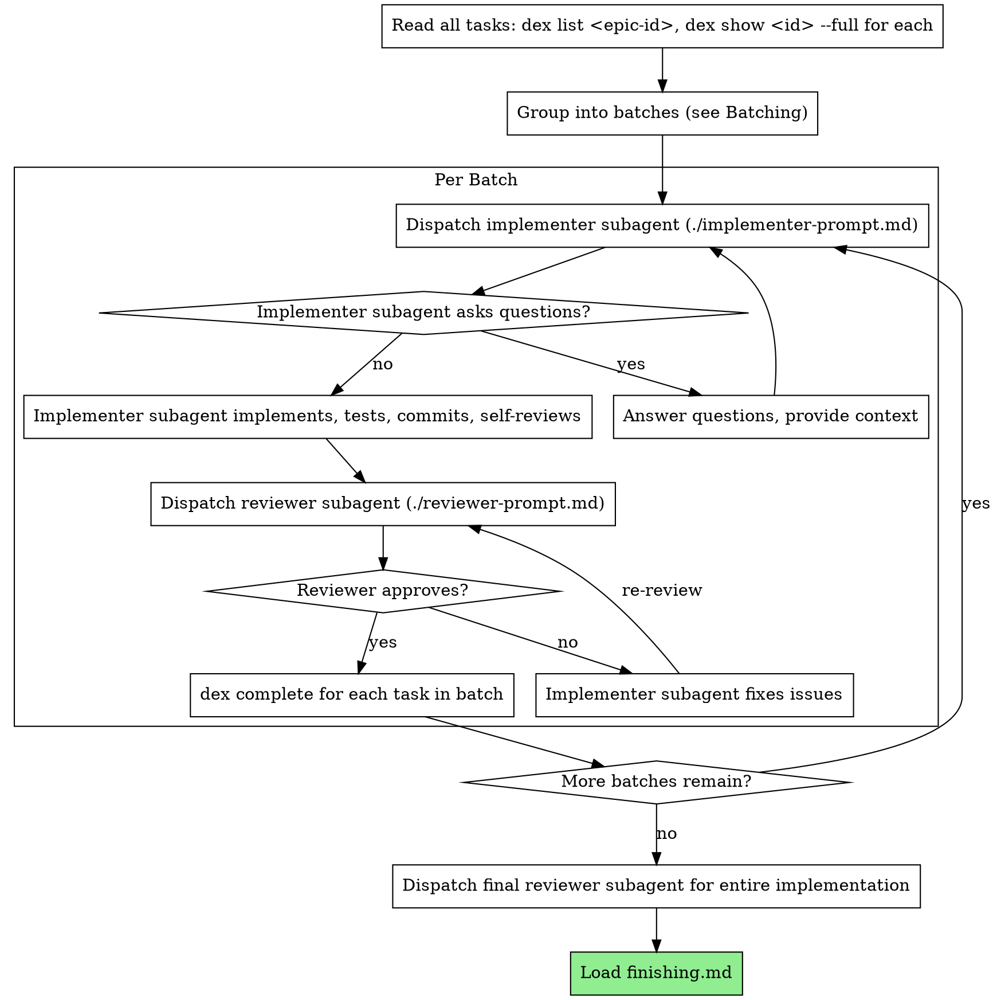

# Subagent-Driven Execution

Execute dex tasks by dispatching subagents, with a unified review after each batch.

**Why subagents:** You delegate tasks to specialized agents with isolated context. By precisely crafting their instructions and context, you ensure they stay focused and succeed at their task. They should never inherit your session's context or history — you construct exactly what they need. This also preserves your own context for coordination work.

**Subagent preparation:** Subagents do not inherit your skills or session context. Every subagent prompt you construct MUST include an instruction to read the relevant skill files from this directory before starting work. At minimum, implementer subagents must read `tdd.md`. Include the absolute path to this skill directory in the prompt so the subagent can find the files. See `implementer-prompt.md` for the required prep section.

**Core principle:** Batch related tasks → single implementer → unified review (spec + quality in one pass) = high quality, less overhead

## The Process



## Setup

Before starting execution:

1. **Survey the task tree:** `dex list <epic-id>` to see all tasks, their statuses, and dependencies. Read individual tasks with `dex show <id>` (without `--full`) to get enough context for batching decisions.
2. **Check for ready tasks:** `dex list --ready` to find unblocked tasks.
3. **Group into batches** (see Batching below).
4. **Identify the execution order** from blocking dependencies between batches.

**Don't read full task descriptions into your own context.** Subagents read their own tasks via `dex show <id> --full`. You only need summaries for batching and coordination.

## Batching

Group related tasks into batches to reduce subagent overhead. Each batch goes to a single implementer, then a single reviewer.

**Batch together** tasks that:
- Are all currently unblocked (no pending dependencies)
- Touch the same files or closely related files
- Share enough context that one subagent can reason about them together

**Keep separate** tasks that:
- Touch unrelated parts of the codebase
- Have dependencies between them (one must complete before the other can start)
- Are individually complex enough to warrant a full subagent's attention

**A batch of one is fine.** Complex or isolated tasks should be their own batch. Batching is an optimization for groups of related small tasks, not a requirement for every task.

**Sizing guidance:**
- 2-4 related tasks touching shared files → good batch
- 5+ tasks or tasks spanning many unrelated files → too large, split
- Single complex task → own batch

## Per-Batch Flow

For each batch:

1. **Mark in-progress:** `dex start <id>` for each task in the batch
2. **Record base SHA:** `git rev-parse HEAD` — you'll need this for the reviewer
3. **Dispatch implementer subagent** using the template in `implementer-prompt.md`. List the dex task IDs (and parent ID if subtasks) — the implementer reads them via `dex show`. Add brief scene-setting context about where these tasks fit.
4. **Handle implementer status** (see below)
5. **Dispatch reviewer subagent** using `reviewer-prompt.md`. Include:
   - The dex task IDs (and parent ID if subtasks) — the reviewer reads them via `dex show`
   - The implementer's status report
   - Base SHA (from step 2) and head SHA (current HEAD after implementer committed)
   - The reviewer runs `git diff` itself — do NOT read the diff into your own context
6. **If reviewer finds issues:** implementer fixes, reviewer re-reviews
7. **Mark complete:** `dex complete <id> --result "What was implemented, key decisions, test results" --commit <sha>` for each task in the batch

## Context Pre-Curation

**Your job as orchestrator is to point, not to read.** Give subagents dex task IDs, commit ranges, and brief scene-setting. They read the details themselves.

For **implementers:** provide dex task IDs (and parent ID for subtasks), brief context about where the tasks fit, and answers to any prior questions. The implementer reads task descriptions and codebase itself.

For **reviewers:** provide dex task IDs, the implementer's status report, and base/head SHAs. The reviewer reads task specs via `dex show` and the diff via `git diff`.

**Do NOT** read full task descriptions, diffs, file contents, or test output into your own context to relay them. That duplicates content across context windows. Subagents have the tools to read what they need — give them pointers, not payloads.

## Model Selection

You pick the subagent's model when you build the dispatch. Pick deliberately — the dispatch templates have a `model:` line and you fill it in before issuing the Agent call. Subagents do not pick their own model.

The plan you produced via `brainstorming.md` already does the hard reasoning upfront, so most implementer and reviewer dispatches do not need the highest tier.

| Tier | Use for | Signals |
|------|---------|---------|
| Fast | Mechanical, well-specced changes | Renames, mechanical refactors, single-file edits with a complete spec, glue/wiring, test scaffolding the spec describes line-by-line |
| General-purpose | **Default** for implementer and per-batch reviewer | Multi-file work where the spec already named the files and approach; routine code review of a focused diff |
| High-reasoning | Reasoning-heavy work | Plan review, final cross-cutting review, debugging across subsystems, tasks where the spec leaves design judgment, escalation after a General-purpose BLOCKED |

**Default to General-purpose.** Drop to Fast only when the task is mechanical and the spec is exhaustive. Use High-reasoning when the routing signals call for it or as an escalation tier.

**Mapping to concrete models.** These tiers are model-agnostic. For Anthropic, the families map as Fast → Haiku, General-purpose → Sonnet, High-reasoning → Opus — substitute the concrete model identifier your runtime accepts (e.g. the CLI shorthand `haiku` / `sonnet` / `opus`, or the latest `claude-*` ID). For other providers, map each tier to that provider's equivalent capability class.

**Routing heuristic** when the task doesn't obviously match the table:

| Heuristic | Route to |
|---|---|
| Spec names exact files, exact function signatures, no decisions deferred | Fast |
| Spec names files but the approach is described, not prescribed | General-purpose |
| Spec leaves design judgment, OR task spans 4+ files with integration concerns, OR a lower tier already returned BLOCKED on this task | High-reasoning |

## Handling Implementer Status

Implementer subagents report one of four statuses. Handle each appropriately:

**DONE:** Proceed to review.

**DONE_WITH_CONCERNS:** The implementer completed the work but flagged doubts. Read the concerns before proceeding. If the concerns are about correctness or scope, address them before review. If they're observations (e.g., "this file is getting large"), note them and proceed to review.

**NEEDS_CONTEXT:** The implementer needs information that wasn't provided. Provide the missing context and re-dispatch.

**BLOCKED:** The implementer cannot complete the task. Assess the blocker:
1. If it's a context problem, provide more context and re-dispatch with the same model
2. If the blocker is reasoning (not missing context), re-dispatch one tier up: Fast → General-purpose → High-reasoning. Don't skip tiers. If General-purpose also returns BLOCKED, the spec is probably the problem, not the model
3. If the task is too large, break it into smaller pieces
4. If the task description itself is wrong, escalate to the human

**Never** ignore an escalation or force the same model to retry without changes. If the implementer said it's stuck, something needs to change.

## After All Tasks

1. **Dispatch final reviewer** for the entire implementation (full diff from branch point). This is a cross-cutting review — it catches integration issues between tasks that per-batch reviews can't see. Use the same `reviewer-prompt.md` template with the full branch diff range.
2. **Address any issues** from the final review
3. **Load `finishing.md`** to complete the branch

## Example Workflow

```
You: I'm executing the dex task tree for epic abc123.

[Survey tasks: dex list abc123]
[dex show def456, dex show ghi789, dex show jkl012 — summaries only for batching]

Batch 1: Tasks def456 + ghi789 (both touch hook installation, share files)

[dex start def456, dex start ghi789]
[Record base SHA: a1b2c3d]
[Dispatch implementer subagent with task IDs def456, ghi789, parent abc123]

Implementer: "Before I begin - should hooks be installed at user or system level?"

You: "User level (~/.config/hooks/)"

Implementer: "Got it. Implementing now..."
[Later] Implementer:
  Status: DONE
  - Implemented install-hook and recovery modes
  - 13/13 tests passing
  - Self-review: clean
  - Committed as f4e5d6c

[Dispatch reviewer subagent with:
  - Task IDs: def456, ghi789 (parent: abc123)
  - Implementer's report
  - Base SHA: a1b2c3d, Head SHA: f4e5d6c]

Reviewer:
  Spec compliance: ✅ All requirements met for both tasks
  Code quality: ⚠️ Approved with fixes
    Important: Magic number (100) for progress reporting interval
  Assessment: Approved with fixes

[Implementer fixes: extracted PROGRESS_INTERVAL constant]

[Re-dispatch reviewer]
Reviewer: ✅ Approved

[dex complete def456 --result "..." --commit g7h8i9j]
[dex complete ghi789 --result "..." --commit g7h8i9j]

Batch 2: Task jkl012 (complex, own batch)

[dex start jkl012]
[Record base SHA: g7h8i9j]
[Dispatch implementer subagent...]

...

[After all batches]
[Dispatch final reviewer for full branch diff]
Final reviewer: ✅ Approved — integration is clean

[Load finishing.md]
```

## Red Flags

**Never:**
- Start implementation on main/master branch without explicit user consent
- Skip review for any batch
- Proceed with unfixed issues
- Give subagents more dex IDs than they need (they'll wander — scope to exactly the relevant tasks)
- Skip scene-setting context (subagent needs to understand where task fits)
- Ignore subagent questions (answer before letting them proceed)
- Accept "close enough" on spec compliance (reviewer found spec issues = not done)
- Skip review loops (reviewer found issues = implementer fixes = review again)
- Let implementer self-review replace actual review (both are needed)
- Move to next batch while review has open issues
- Read diffs or file contents into your own context to relay to subagents (point, don't read)

**If subagent asks questions:**
- Answer clearly and completely
- Provide additional context if needed
- Don't rush them into implementation

**If reviewer finds issues:**
- Implementer (same subagent) fixes them
- Reviewer reviews again
- Repeat until approved
- Don't skip the re-review

**If subagent fails task:**
- Dispatch fix subagent with specific instructions
- Don't try to fix manually (context pollution)

## Advantages

**vs. Manual execution:**
- Subagents follow TDD naturally
- Fresh context per batch (no confusion)
- Parallel-safe (subagents don't interfere)
- Subagent can ask questions (before AND during work)

**Efficiency gains:**
- Batching reduces cold-start overhead for related tasks
- Unified review (spec + quality) eliminates redundant codebase exploration
- Reviewer starts from `git diff` — focused on the delta, not exploring the repo
- Subagents read their own task specs via dex — no content duplication across context windows
- Controller stays lightweight: task IDs and SHAs, not full descriptions and diffs
- Questions surfaced before work begins (not after)

**Quality gates:**
- Self-review catches issues before handoff
- Unified review checks both spec compliance and code quality
- Review loops ensure fixes actually work
- Spec compliance prevents over/under-building
- Final cross-cutting review catches integration issues between batches
