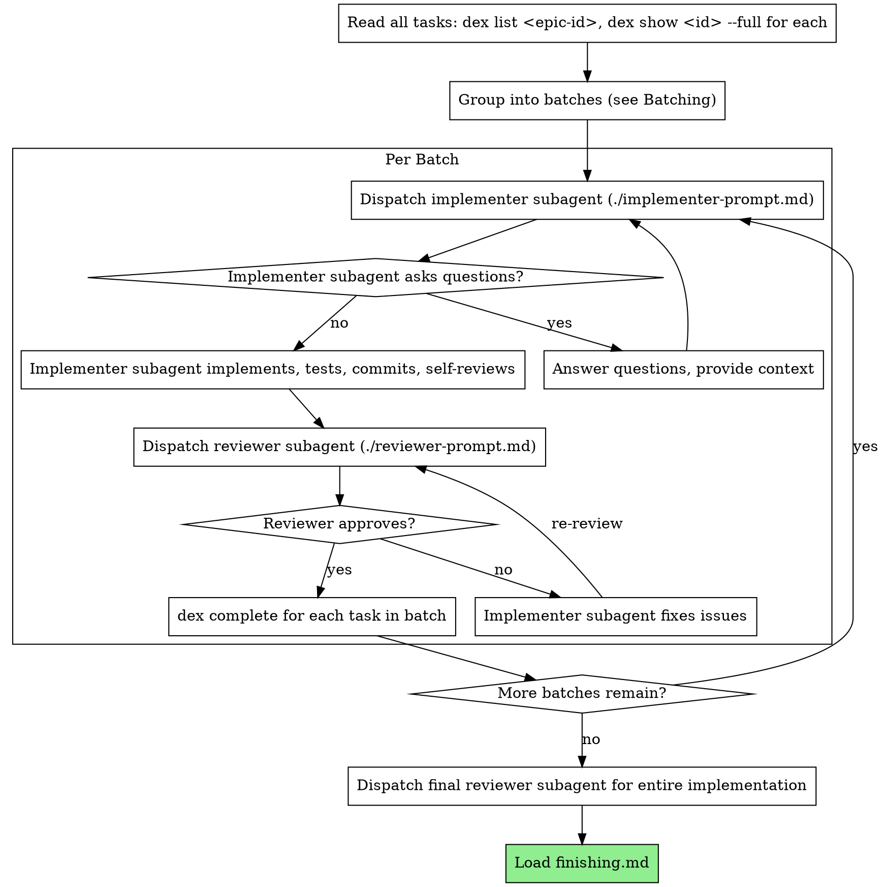

# Subagent-Driven Execution

Execute dex tasks by dispatching subagents, with a unified review after each batch.

**Why subagents:** You delegate tasks to specialized agents with isolated context. By precisely crafting their instructions and context, you ensure they stay focused and succeed at their task. They should never inherit your session's context or history — you construct exactly what they need. This also preserves your own context for coordination work.

**Subagent preparation:** Subagents do not inherit your skills or session context. Every subagent prompt you construct MUST include an instruction to read the relevant skill files from this directory before starting work. At minimum, implementer subagents must read `tdd.md`. Include the absolute path to this skill directory in the prompt so the subagent can find the files. See `implementer-prompt.md` for the required prep section.

**Core principle:** Batch related tasks → single implementer → unified review (spec + quality in one pass) = high quality, less overhead

## The Process



## Setup

Before starting execution:

1. **Read all tasks upfront:** `dex list <epic-id>` to get the full task tree, then `dex show <id> --full` for each task. Extract the full text and context now — don't make subagents read dex.
2. **Check for ready tasks:** `dex list --ready` to find unblocked tasks.
3. **Group into batches** (see Batching below).
4. **Identify the execution order** from blocking dependencies between batches.

## Batching

Group related tasks into batches to reduce subagent overhead. Each batch goes to a single implementer, then a single reviewer.

**Batch together** tasks that:
- Are all currently unblocked (no pending dependencies)
- Touch the same files or closely related files
- Share enough context that one subagent can reason about them together

**Keep separate** tasks that:
- Touch unrelated parts of the codebase
- Have dependencies between them (one must complete before the other can start)
- Are individually complex enough to warrant a full subagent's attention

**A batch of one is fine.** Complex or isolated tasks should be their own batch. Batching is an optimization for groups of related small tasks, not a requirement for every task.

**Sizing guidance:**
- 2-4 related tasks touching shared files → good batch
- 5+ tasks or tasks spanning many unrelated files → too large, split
- Single complex task → own batch

## Per-Batch Flow

For each batch:

1. **Mark in-progress:** `dex start <id>` for each task in the batch
2. **Record base SHA:** `git rev-parse HEAD` — you'll need this for the reviewer
3. **Dispatch implementer subagent** using the template in `implementer-prompt.md`. Paste the full task descriptions (from `dex show <id> --full` for each task in the batch) into the prompt. Include parent context if they're subtasks.
4. **Handle implementer status** (see below)
5. **Dispatch reviewer subagent** using `reviewer-prompt.md`. Include:
   - The task specs (same text you gave the implementer)
   - The implementer's status report
   - Base SHA (from step 2) and head SHA (current HEAD after implementer committed)
   - The reviewer runs `git diff` itself — do NOT read the diff into your own context
6. **If reviewer finds issues:** implementer fixes, reviewer re-reviews
7. **Mark complete:** `dex complete <id> --result "What was implemented, key decisions, test results" --commit <sha>` for each task in the batch

## Context Pre-Curation

**Your job as orchestrator is to point, not to read.** You know the task spec and the commit range. The subagent does the heavy reading.

For **implementers:** provide full task descriptions, parent context, and any answers to prior questions. The implementer reads the codebase itself.

For **reviewers:** provide the task spec, implementer's report, and the base/head SHAs. The reviewer starts by running `git diff <base>..<head>` to see exactly what changed. This focuses the review on the actual delta instead of requiring the reviewer to explore the codebase to discover what was modified.

**Do NOT** read diffs, file contents, or test output into your own context to relay them. That pollutes your context window with content that belongs in the subagent's context.

## Model Selection

Use the least powerful model that can handle each role to conserve cost and increase speed.

**Mechanical implementation tasks** (isolated functions, clear specs, 1-2 files): use a fast, cheap model. Most implementation tasks are mechanical when the task description is well-specified.

**Integration and judgment tasks** (multi-file coordination, pattern matching, debugging): use a standard model.

**Architecture, design, and review tasks**: use the most capable available model.

**Task complexity signals:**
- Touches 1-2 files with a complete spec → cheap model
- Touches multiple files with integration concerns → standard model
- Requires design judgment or broad codebase understanding → most capable model

## Handling Implementer Status

Implementer subagents report one of four statuses. Handle each appropriately:

**DONE:** Proceed to review.

**DONE_WITH_CONCERNS:** The implementer completed the work but flagged doubts. Read the concerns before proceeding. If the concerns are about correctness or scope, address them before review. If they're observations (e.g., "this file is getting large"), note them and proceed to review.

**NEEDS_CONTEXT:** The implementer needs information that wasn't provided. Provide the missing context and re-dispatch.

**BLOCKED:** The implementer cannot complete the task. Assess the blocker:
1. If it's a context problem, provide more context and re-dispatch with the same model
2. If the task requires more reasoning, re-dispatch with a more capable model
3. If the task is too large, break it into smaller pieces
4. If the task description itself is wrong, escalate to the human

**Never** ignore an escalation or force the same model to retry without changes. If the implementer said it's stuck, something needs to change.

## After All Tasks

1. **Dispatch final reviewer** for the entire implementation (full diff from branch point). This is a cross-cutting review — it catches integration issues between tasks that per-batch reviews can't see. Use the same `reviewer-prompt.md` template with the full branch diff range.
2. **Address any issues** from the final review
3. **Load `finishing.md`** to complete the branch

## Example Workflow

```
You: I'm executing the dex task tree for epic abc123.

[Read all tasks: dex list abc123]
[dex show def456 --full, dex show ghi789 --full, dex show jkl012 --full, ...]
[Extract all task text and context]

Batch 1: Tasks def456 + ghi789 (both touch hook installation, share files)

[dex start def456, dex start ghi789]
[Record base SHA: a1b2c3d]
[Dispatch implementer subagent with both task descriptions]

Implementer: "Before I begin - should hooks be installed at user or system level?"

You: "User level (~/.config/hooks/)"

Implementer: "Got it. Implementing now..."
[Later] Implementer:
  Status: DONE
  - Implemented install-hook and recovery modes
  - 13/13 tests passing
  - Self-review: clean
  - Committed as f4e5d6c

[Dispatch reviewer subagent with:
  - Both task specs
  - Implementer's report
  - Base SHA: a1b2c3d, Head SHA: f4e5d6c]

Reviewer:
  Spec compliance: ✅ All requirements met for both tasks
  Code quality: ⚠️ Approved with fixes
    Important: Magic number (100) for progress reporting interval
  Assessment: Approved with fixes

[Implementer fixes: extracted PROGRESS_INTERVAL constant]

[Re-dispatch reviewer]
Reviewer: ✅ Approved

[dex complete def456 --result "..." --commit g7h8i9j]
[dex complete ghi789 --result "..." --commit g7h8i9j]

Batch 2: Task jkl012 (complex, own batch)

[dex start jkl012]
[Record base SHA: g7h8i9j]
[Dispatch implementer subagent...]

...

[After all batches]
[Dispatch final reviewer for full branch diff]
Final reviewer: ✅ Approved — integration is clean

[Load finishing.md]
```

## Red Flags

**Never:**
- Start implementation on main/master branch without explicit user consent
- Skip review for any batch
- Proceed with unfixed issues
- Make subagent read dex tasks directly (provide full text instead)
- Skip scene-setting context (subagent needs to understand where task fits)
- Ignore subagent questions (answer before letting them proceed)
- Accept "close enough" on spec compliance (reviewer found spec issues = not done)
- Skip review loops (reviewer found issues = implementer fixes = review again)
- Let implementer self-review replace actual review (both are needed)
- Move to next batch while review has open issues
- Read diffs or file contents into your own context to relay to subagents (point, don't read)

**If subagent asks questions:**
- Answer clearly and completely
- Provide additional context if needed
- Don't rush them into implementation

**If reviewer finds issues:**
- Implementer (same subagent) fixes them
- Reviewer reviews again
- Repeat until approved
- Don't skip the re-review

**If subagent fails task:**
- Dispatch fix subagent with specific instructions
- Don't try to fix manually (context pollution)

## Advantages

**vs. Manual execution:**
- Subagents follow TDD naturally
- Fresh context per batch (no confusion)
- Parallel-safe (subagents don't interfere)
- Subagent can ask questions (before AND during work)

**Efficiency gains:**
- Batching reduces cold-start overhead for related tasks
- Unified review (spec + quality) eliminates redundant codebase exploration
- Reviewer starts from `git diff` — focused on the delta, not exploring the repo
- Controller points subagents at the right context without reading it itself
- Questions surfaced before work begins (not after)

**Quality gates:**
- Self-review catches issues before handoff
- Unified review checks both spec compliance and code quality
- Review loops ensure fixes actually work
- Spec compliance prevents over/under-building
- Final cross-cutting review catches integration issues between batches
